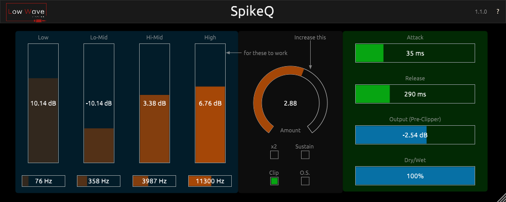

# SpikeQ
EQ / Transient Shaper

SpikeQ is a frequency based transient shaper.
As a distant cousin of Drum Snapper, it features the same attitude for
increasing the Attack of a source, but expands it with the ability to enhance
certain frequency areas on the attack portion of a sound.
Now with the ability to choose between adding more Attack or Sustain.
Do you have a source that is too buried in a mix?
Do you want to make certain frequencies pop?
SpikeQ enables you to add huge boosts of eq but not making them too
boomy and loose (in the low end) or too splashy (in the high end).
With the Sustain manipulation you can have huge Drum room sounds
without splashy cymbals or add more body to an acoustic guitar and
remove the unwanted resonances of the sustain.

- It features 4 semi-parametric eq bands (low and high shelves and 2 peak bands);
- Add attack or Sustain to be treated by the EQ;
- 2x Amount to use on sources with low dynamic range or to have extreme effects;
- A Clipper to avoid big spikes on the audio;
- Oversampling for the clipper section, to avoid aliasing;
- Attack and Release controls to shape the behavior of the transient shaper;
- Output gain (pre-clipper);
- Dry/Wet control to mix between the processed and unprocessed signal;

Made using the JUCE framework

These plugins are free to use and I make them on my spare time. If you like them and are able to help by becoming a [Patreon](https://www.patreon.com/lowwavestudios) member, I would be very grateful.

Changelog v1.1.0:
- Add Subtract mode to EQ bands;
- Add Sustain mode (Add EQ'ed sustain to signal);
- Increased Release time range;
- Instant Attack time (more accurate);
- Fix latency compensation when Clipper off and Oversample on;
- Add save window size for each instance;
- Changed Slider behaviour:
	- Right double-click to return to default value;
	- Ctrl + drag for fine adjustment;

